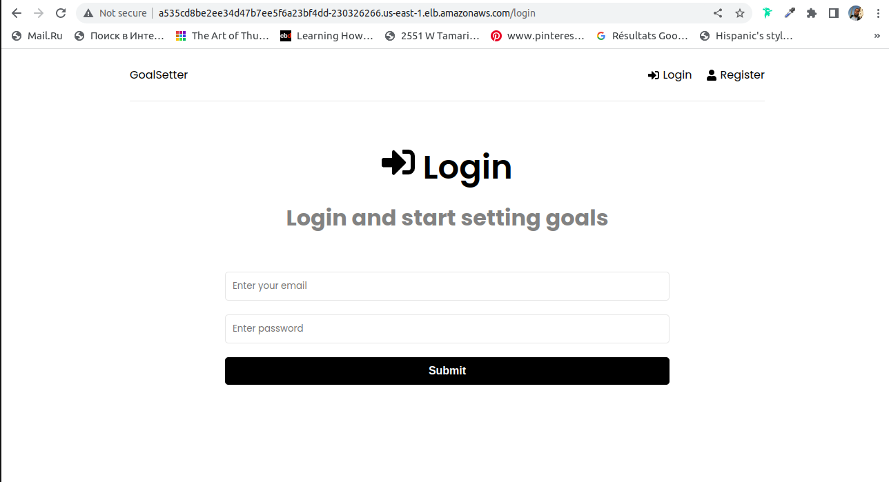

[](https://dl.circleci.com/status-badge/redirect/gh/mersile-atti/Udacity-Capstone-Project/tree/main)
# Udacity-Capstone-Project: Goalsetter MERN app

This is the goalsetter app from the [Learn the MERN Stack](https://www.youtube.com/watch?v=-0exw-9YJBo) series on YouTube.

## Overview

In this project I apply the skills and knowledge which were developed throughout the Cloud DevOps Nanodegree program. These include:

Working in AWS
Using Jenkins or Circle CI to implement Continuous Integration and Continuous Deployment
Building pipelines
Working with Ansible and CloudFormation to deploy clusters
Building Kubernetes clusters
Building Docker containers in pipelines

## Application
A fullstack application based on MERN STACK:
* RESTful API from scratch with Node.js, Express, MongoDB and Mongoose.
* Frontend with React and add authentication using Redux Toolkit to manage our global state
* And finally we secure our API by adding JWT authentication

### File description 

* `.circleci` - CircleCI Pipeline config.
* `src` - Application source code, Dockerfile, K8S deployment template.
* `cloudformation` - cluuster config used to deploy a kubernetes cluster using eksctl.
* `.K8s/templates` - config file for kubernetes cluster.
* `screenshots` - Screenshots for deployment, application logs and CircleCI pipeline.
* `Makefile` 	Set of instructions that you use to setup environment: setup, install, tests and lints ...
* `Dockerfile` 	Contains the commands used to create a docker image

## Getting Started

### Prerequisites
- AWS account
- Install and configure the necessary plugins : aws, git, docker, kubectl, eksctl

### Setup
Create EKS cluster by running the command below: 
```sh
eksctl create cluster -f cloudformation/eks-cluster.yml 
```
### Configure CircleCi environment variables

```sh
AWS_ACCESS_KEY_ID		
AWS_DEFAULT_REGION		
AWS_SECRET_ACCESS_KEY		
DOCKERHUB_PASSWORD		
DOCKERHUB_USERNAME		
DOCKER_IMAGE_NAME	
```

Run the CircleCi pipeline.

Make sure that your the local kubernetes this up-to-date with the aws eks cluster by running the command below :

```sh
aws eks update-kubeconfig --region us-east-1 --name mern-app
```

## Check deployment

### Image repository

DockerHub: [mern-app](https://hub.docker.com/repository/docker/mersileatti/mern-app)

### Running pods

```sh
kubectl get svc,po,deploy
```


## Running Web APP

